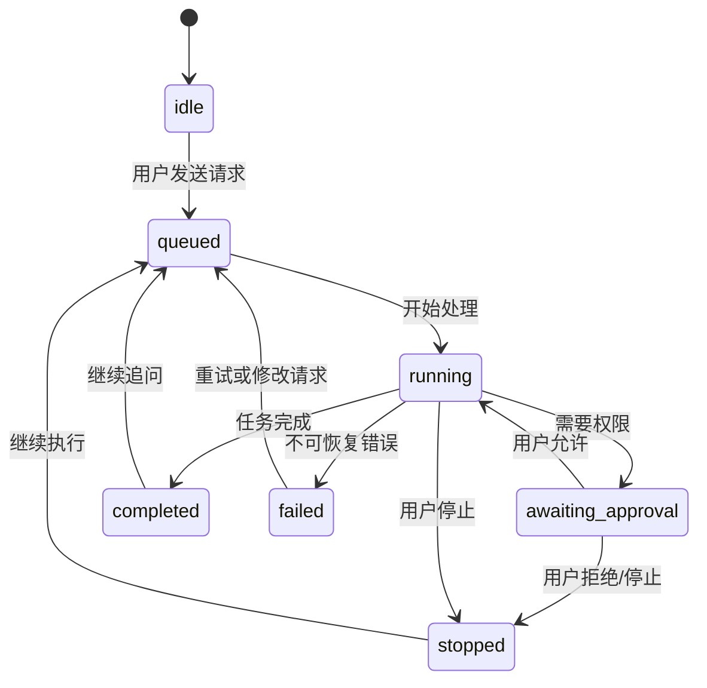

# Codex 风格桌面端设计规格（可实现参考）

> 版本：1.0  
> 目标读者：产品设计师、UX/UI 设计师、桌面端架构师、前端工程师、QA  
> 范围：一个以 AI 协作、代码任务和本地工作区为中心的跨平台桌面应用。本文描述可复用的体验原则与实现规格，不依赖或复刻任何专有内部实现。

## 1. 产品定位与体验目标

产品是一个“任务优先”的 AI 工作台：用户在一个持续上下文的任务中与 AI 协作、查看执行过程、检查本地改动，并按需分叉或归档任务。它不是传统聊天窗口，也不是完整 IDE；核心价值是把一次复杂工作组织成可追溯、可控制、可恢复的执行单元。

体验应当同时具备三种气质：

- **安静且专注**：默认低饱和深色界面，避免持续争抢注意力；阅读与输入始终是视觉主角。
- **可见且可信**：AI 正在做什么、何时需要用户、是否修改了文件，均以渐进信息展示；不把长日志默认压给用户。
- **像桌面软件而非网页**：支持原生窗口拖拽、菜单、快捷键、文件路径、分栏和长时任务；状态在切换任务后保持。

### 1.1 设计原则

1. **任务大于消息**：侧栏呈现任务，主区呈现一个任务的完整工作流；消息只是其中的事件。
2. **默认渐进披露**：先给结论和状态，再让用户展开命令、补丁、日志、引用和思考过程。
3. **控制权常驻**：停止、批准、编辑输入、查看变更和恢复历史始终可达，但不干扰普通阅读。
4. **视觉层级少而清楚**：只使用页面、面板、浮层三个主要层级；少用卡片嵌套和重边框。
5. **动效解释状态变化**：动效只用于“从哪里来、到哪里去、现在是否仍在进行”，不用于装饰。

## 2. 信息架构与窗口分布

### 2.1 顶层窗口

| 窗口/层 | 触发方式 | 职责 | 关闭后的行为 |
| --- | --- | --- | --- |
| 主窗口 | 启动应用 | 任务、对话、执行过程、变更预览 | 记住尺寸、位置、最后任务 |
| 工作区选择器 | 切换根目录/新建任务时 | 搜索并选择本地项目、显示最近目录 | 回到原任务，不丢失草稿 |
| 命令面板 | `Ctrl/Cmd+K` | 快速跳转、创建任务、切换主题、打开设置 | Esc 关闭，恢复原焦点 |
| 设置窗口/抽屉 | 左下角设置或命令面板 | 模型、权限、外观、通知、快捷键 | 即时保存；高风险项要求确认 |
| 文件/差异预览 | 点击文件变更 | 查看补丁、文件内容、可选的接受/回退操作 | 保持任务滚动位置 |
| 系统级通知 | 长任务完成、需要批准、发生错误 | 把用户带回相关任务 | 点击进入精确事件位置 |

主窗口最小建议尺寸为 **1024 × 680 px**；低于此尺寸时，左侧栏收至图标/抽屉，右侧上下文面板改为覆盖层。推荐工作尺寸为 1440 × 900 px 或以上。

### 2.2 主窗口布局

```text
┌────────────────────── Windows/macOS 原生标题栏 ──────────────────────┐
├─────┬──────────────────────┬───────────────────────────────────────┤
│ 窄  │ 任务侧栏             │ 顶部任务栏                            │
│ 导航 │ + 新建任务          ├───────────────────────────────────────┤
│ 栏  │ 搜索 / 筛选          │                                       │
│     │ 分组：今天、最近、   │ 任务时间线 / 对话主区                 │
│     │ 已归档、固定         │ （用户消息、AI 回复、执行事件）       │
│     │                      │                                       │
│     │ 任务条目             │                                       │
│     │                      │                                       │
│     │                      ├───────────────────────────────────────┤
│     │                      │ 上下文条 / 附件 / 模式提示（可选）     │
│     │                      ├───────────────────────────────────────┤
│     │                      │ 固定输入区 + 发送/停止/模型控件        │
├─────┴──────────────────────┴───────────────────────────────────────┤
│ 状态栏：工作区、分支、权限、同步/离线、版本                         │
└────────────────────────────────────────────────────────────────────┘
```

**宽度规则**：窄导航栏 52 px；任务侧栏默认 272 px（可拖拽，范围 228–380 px）；主区最小 640 px。侧栏与主区间的分隔线为 1 px，悬停时显示拖拽手柄和强调色。主区内容列不应无限变宽：消息正文最大 820 px，剩余空间作为呼吸留白。

### 2.3 响应式断点

| 条件 | 布局策略 |
| --- | --- |
| ≥ 1280 px | 完整三列：导航、任务侧栏、主内容 |
| 1024–1279 px | 保持任务侧栏，隐藏非必要状态文字 |
| 800–1023 px | 任务侧栏变成可召回覆盖抽屉；主内容全宽 |
| < 800 px | 不建议作为主要工作形态；保留单栏对话和底部工具抽屉 |

## 3. 导航、边栏与任务交互

### 3.1 窄导航栏

垂直排列，顶部放置产品标识和“新建任务”主按钮，中段为任务/搜索/工作区入口，底部为通知、帮助、设置与用户菜单。图标均配 Tooltip；仅在窗口宽度紧张时使用纯图标。当前入口以 2 px 左侧高亮条 + 低对比填充表示，不能仅靠颜色区分。

### 3.2 任务侧栏

任务条目由标题、最后活动时间、状态点和可选的工作区标签组成。标题最多两行，溢出省略；悬停才出现更多操作。推荐分组为“固定”“今天”“最近 7 天”“更早”“已归档”。

| 操作 | 交互与反馈 |
| --- | --- |
| 单击任务 | 立即切换主区；保留各任务自己的阅读位置与输入草稿 |
| 双击标题 | 原地编辑标题；Enter 保存，Esc 取消 |
| 右键/更多菜单 | 固定、重命名、分叉、归档、导出、删除（最后一项危险样式） |
| 拖入文件 | 将文件作为上下文附件；显示类型、大小和移除按钮 |
| 搜索 | 即时本地过滤标题、工作区和消息摘要；`↑↓` 选中，Enter 打开 |

选中态不应使用高亮蓝色大块填满侧栏；采用略亮于表面的中性底色、标题高对比、左侧细色条即可。进行中的任务显示低频脉冲点，完成后转为静态成功色，错误为静态警告色。

### 3.3 任务顶部栏

从左到右：任务标题（可编辑）、工作区路径与分支、任务状态、右侧的上下文/变更/更多操作。路径使用等宽字体并截断中部，例如 `C:\Users\…\kaoyan_planner`；悬停显示完整路径并提供复制。

当任务运行时，顶部栏显示“正在执行”与可点击的停止控件。停止是可逆的流程中断，不等于删除；操作后向时间线插入“已由用户停止”的事件。

## 4. 主内容区：时间线与输入

### 4.1 时间线事件模型

每个事件具有 `id、taskId、timestamp、actor、kind、status、payload、visibility` 字段；按时间追加，支持折叠。建议事件类型如下：

| 类型 | 默认呈现 | 展开后 |
| --- | --- | --- |
| 用户请求 | 右对齐或轻量强调的文本块 | 编辑、复制、引用附件 |
| AI 回复 | 左对齐正文，支持 Markdown | 复制、重试、引用来源 |
| 执行摘要 | 一行状态：如“已检查 8 个文件” | 命令、耗时、完整输出 |
| 文件变更 | 文件数与增删行概览 | 差异预览、按文件筛选 |
| 权限请求 | 明确风险说明和操作按钮 | 命令/路径/影响范围 |
| 系统错误 | 简洁错误与恢复建议 | 技术详情、复制诊断信息 |

不要将工具日志伪装成 AI 的自然语言回复。工具事件使用较弱的等宽排版和状态图标，并提供“显示详情”。连续同类事件应合并，例如 12 条文件读取事件默认折叠为一条摘要。

### 4.2 输入区

输入区固定在主区底部，背景略高于页面表面，上方只用细分隔线。多行文本框高度从 44 px 自动增长至 180 px，之后内部滚动。左侧放附件/上下文入口；右侧依次为模式选择、模型选择、发送按钮。任务运行时，发送按钮替换为停止按钮；用户仍可在输入框里起草下一条消息。

支持：`Enter` 发送、`Shift+Enter` 换行、`Ctrl/Cmd+Enter` 强制发送、粘贴图片/文件、拖放文件、`@` 引用文件或任务上下文。发送前若检测到敏感路径、超大附件或会触发高权限执行，应在输入区上方给出非阻断提示；只有实际执行危险操作时才请求明确批准。

## 5. 权限、变更与安全交互

### 5.1 权限请求卡片

权限请求必须说清三件事：**要做什么、作用范围是什么、为什么此刻需要**。按钮从左到右为“拒绝”“仅本次允许”“在此工作区始终允许”；最后一项只适用于低到中风险类别。破坏性命令不允许持久授权。

危险级别按颜色和图标双重编码：

- 信息：读取文件、分析代码；使用蓝灰图标。
- 注意：网络访问、安装依赖、写入多个文件；使用琥珀色图标。
- 危险：删除、覆盖、提交/发布、访问密钥；使用红色图标和清楚的目标列表。

### 5.2 变更查看器

变更查看器为右侧可停靠面板或独立窗口。顶部显示 `N 个文件 · +A / -B`，中部左侧为文件树、右侧为 unified diff；支持只看已修改、只看未跟踪、按路径搜索。新增为绿色调，删除为红色调，但文字和符号也要保证在色觉障碍下可理解。每次接受、回退、打开外部编辑器都写入时间线。

回退必须只针对明确选中的文件/块，先显示受影响路径；不可使用“回退全部”作为默认主操作。没有版本控制或无法安全恢复时，按钮应禁用并说明原因。

## 6. 视觉系统

### 6.1 颜色令牌（深色默认）

| 令牌 | 值 | 用途 |
| --- | --- | --- |
| `bg.canvas` | `#171717` | 应用最底层背景 |
| `bg.sidebar` | `#1C1C1C` | 导航与任务列表 |
| `bg.surface` | `#212121` | 主内容、输入区 |
| `bg.elevated` | `#2A2A2A` | 菜单、悬浮层、选中底色 |
| `border.subtle` | `#353535` | 分隔线、输入框边界 |
| `text.primary` | `#F3F3F3` | 标题、核心正文 |
| `text.secondary` | `#B5B5B5` | 说明、元数据 |
| `text.muted` | `#7C7C7C` | 时间、禁用文字 |
| `accent.primary` | `#10A37F` | 主要确认、活跃状态、焦点 |
| `accent.hover` | `#0E8E70` | 主要按钮悬停 |
| `status.warning` | `#E6A23C` | 风险、待确认 |
| `status.danger` | `#E05252` | 错误、删除 |
| `status.success` | `#39B77A` | 完成 |

强调色占屏幕面积不应超过约 5%。大面积背景保持中性灰黑；不要用纯黑、纯白或高饱和渐变。浅色模式只替换语义令牌，不改变布局与状态逻辑。

### 6.2 字体、间距与圆角

- UI 字体：系统无衬线（Windows: Segoe UI；macOS: SF Pro；Linux: Inter/Noto Sans）。
- 代码/路径：JetBrains Mono、Cascadia Code 或系统等宽字体。
- 正文：14 px / 22 px；元数据：12 px / 18 px；标题：16–20 px；页面级标题：24 px。
- 采用 4 px 间距基准：4、8、12、16、24、32、48。
- 小控件圆角 6 px，输入区与卡片 10 px，浮层 12 px；不使用胶囊化的一切控件。
- 焦点环：2 px `accent.primary`，外加 2 px 同色 30% 透明扩散，键盘操作时始终显示。

## 7. 动效与状态反馈

统一使用 `prefers-reduced-motion` / 系统“减少动态效果”设置；开启后取消位移与循环动画，仅保留 100–150 ms 的不透明度变化。

| 场景 | 动效规格 | 目的 |
| --- | --- | --- |
| 切换任务 | 内容淡入 + 4 px 上移，160 ms，ease-out | 表示上下文切换，不像页面跳转 |
| 打开侧栏/面板 | 宽度或平移 180 ms，ease-out | 明确面板来自边缘 |
| 新事件进入 | 透明度 0→1、Y 8→0，180 ms | 指示时间线追加 |
| 执行中 | 2–3 个低对比点交替呼吸，1200 ms 循环 | 表示仍在工作，避免加载转圈焦虑 |
| 成功/失败 | 状态图标 140 ms 缩放至 1，随后静止 | 提供结果确认，不制造庆祝噪音 |
| 危险确认 | 无弹跳；确认按钮按下 80 ms | 保持严肃，降低误触 |

所有动画必须可中断：如果用户在动画中再次切换任务或关闭面板，立即以新目标状态为准。不要为了播放完成而锁住输入或导航。

## 8. 关键状态机与边界情况

任务状态：`idle → queued → running → awaiting_approval → running → completed`，也可从 `running` 进入 `stopped` 或 `failed`。状态变化必须由可追溯事件驱动，而非仅靠局部 UI 标志。



必须处理的边界：离线时保留草稿和本地时间线并标识“待同步”；应用重启后恢复运行中任务为“已中断，是否继续”；同一工作区被外部修改时提示重新扫描；长输出流保持自动滚动但用户一旦手动上滚即暂停跟随，并显示“回到底部”按钮。

## 9. 设置与用户可控项

设置采用左侧类别、右侧内容的窗口或抽屉。每项提供即时预览或可回退说明，避免深层模态框。

| 类别 | 核心设置 |
| --- | --- |
| 外观 | 跟随系统/深色/浅色、紧凑密度、代码字体、减少动效 |
| AI 与执行 | 默认模型、思考/执行可见性、自动运行范围、网络与工具权限策略 |
| 工作区 | 默认根目录、忽略规则、Git 集成、外部编辑器 |
| 通知 | 完成、需要批准、错误；系统通知与声音分别开关 |
| 隐私 | 本地历史保留时长、遥测选择、清除本地数据、敏感信息屏蔽 |
| 快捷键 | 搜索、命令面板、新任务、切换任务、停止、打开变更 |

高影响设置（例如自动批准、允许网络、清除历史）需带风险说明与二次确认；普通外观设置即时生效并提供“恢复默认”。

## 10. 可访问性与验收标准

- 所有核心操作都可在键盘完成；Tab 顺序遵循视觉顺序，焦点不会陷入非模态浮层。
- 正文与背景对比度至少 4.5:1；大文本至少 3:1；状态不可只靠颜色表达。
- 图标按钮有可读名称与 Tooltip；动态执行状态使用 `aria-live="polite"`，不重复播报流式文本。
- 支持 200% 缩放而不遮挡输入、停止和批准按钮；长路径与长任务标题可复制、可查看完整值。
- 删除、覆盖、发布类操作均具有明确对象、风险级别与撤销/恢复路径（若可用）。

### 10.1 发布前验收清单

- [ ] 在 1024 px 宽度下可创建、切换、归档任务并完成一次输入。
- [ ] 运行、等待批准、完成、失败、停止五种状态均有明确且一致的视觉反馈。
- [ ] 用户手动上滚后，流式输出不会抢夺阅读位置。
- [ ] 危险操作无法通过单次误点触发，且显示精确影响范围。
- [ ] 键盘、屏幕阅读器、减少动效、浅/深色模式均通过核心流程验证。
- [ ] 用户重启应用、切换工作区、网络中断后，任务历史、草稿与错误恢复符合预期。

## 11. 工程实现建议

架构建议采用：原生壳（Electron、Tauri 或等价方案）+ Web 渲染层 + 本地持久化任务存储 + 独立执行/工具进程。UI 与执行器通过结构化事件协议通信，避免将终端文本作为唯一数据源。关键实体为 `Workspace`、`Task`、`TimelineEvent`、`PermissionRequest`、`FileChange`、`UserPreference`；每个实体都应有稳定 ID、创建/更新时间与可序列化状态。

前端将视觉令牌定义为语义化 CSS Variables/Design Tokens，而不是散落在组件中的十六进制值。状态与副作用由集中状态机管理；流式消息、终端输出、文件变更采用 append-only 事件流，UI 负责归并展示。这样可以保证恢复、审计、分叉任务及后续多窗口支持的可行性。

